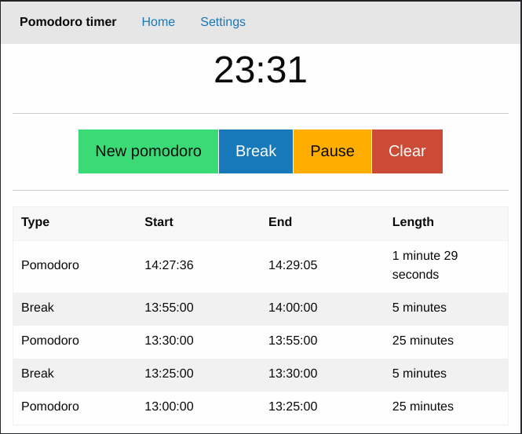
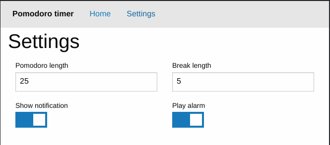

# Pomodoro timer React Next.js app

This is a React Next.js project bootstrapped with
[`create-next-app`](https://github.com/vercel/next.js/tree/canary/packages/create-next-app).

It uses the following libraries:

* [React](https://reactjs.org/)
* [Next.js](https://nextjs.org/)
* [TypeScript](https://www.typescriptlang.org/)
* [Foundation](https://get.foundation/)
* [date-fns](https://date-fns.org/)

## How to run

Install dependencies:

```
npm install
```

Run in development mode:

```
npm run dev
```

Export:

```
npm run export
```

## Screenshots

Screenshot of the main page:



Screeshot of the settings page:



## Credits

Notification sound:

* [Synth Gliss by InspectorJ](https://freesound.org/people/InspectorJ/sounds/370195/),
  licensed under CC BY 4.0.
